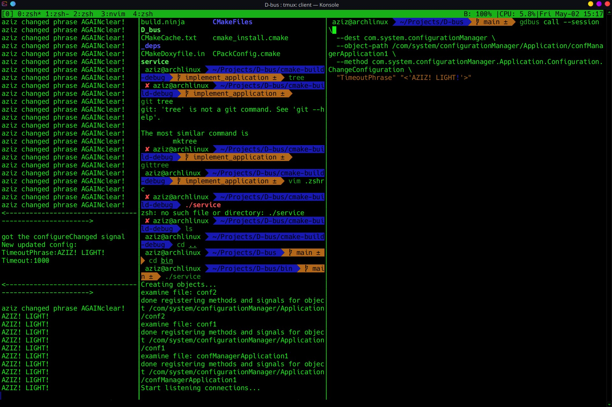

# D-Bus-Configuration-Managed

## Описание
Данный репозиторий является решением тестовой задачи D-Bus Configuration Managed. Автор - Азиз Вундиров. 


## Технологический стек
- C++20
- sdbus-c++
- cmake
- bash scripts


## Build проекта

- В папке проекта запускаем скрипт build.sh 
```bash
./build.sh
```
- в папке build появятся 2 бинарика: **service** и **applciation**
- появится директория ~/com.system.configurationManager c конфиг файлом **confManagerApplication1**
#### Примечание
формат храния данных в файлах конфигураций выбран следующий:
```bash
<key>:<value>
```
Например:

```bash
Timeout:1000
```
Расширение файлов конфигураций прописывать в имени не обязательно (имя конфига может быть как conf.txt, так и просто conf)
## Использование
- Запускаем **сначала service** (нижеперечисленные команды запускать с **корневой папки**)
```bash
./bin/service
```
- Затем запускаем **application**
```bash
./bin/application
```
- Для вызова методов сервиса через терминал используем команду
```bash

 gdbus call --session \
  --dest com.system.configurationManager \
  --object-path /com/system/configurationManager/Application/confManagerApplication1 \
  --method com.system.configurationManager.Application.Configuration.<method_name> \
  <key> <value>
```
call - вызывает метод или сигнал

--session - тип шины

--dest - название сервиса

-- object-path - путь к объекту

-- method название метода в виде <interface_name>.<method_name>

-- в конце указываем аргументы
- Для получения списка всех доступных методов в интерфейсе объекта используем команду
```bash

gdbus introspect --session \
  --dest com.system.configurationManager \
  --object-path /com/system/configurationManager/Application/<object_name>
```

### Примеры использования:

- **Сначала запускаем service**, за ним - applciation.
- Изначально в конфиге **confManagerApplication1** находятся следующие параметры:
```bash
Timeout:1000
TimeoutPhrase:hello from aziz
``````
Изменяем **TimeoutPhrase**

```bash
gdbus call --session \
  --dest com.system.configurationManager \
  --object-path /com/system/configurationManager/Application/confManagerApplication1 \
  --method com.system.configurationManager.Application.Configuration.ChangeConfiguration \
  "TimeoutPhrase" "<'AZIZ! LIGHT!'>"

```
В терминале должно выводится AZIZ! LIGHT! каждую секунду

```bash
gdbus call --session \
  --dest com.system.configurationManager \
  --object-path /com/system/configurationManager/Application/confManagerApplication1 \
  --method com.system.configurationManager.Application.Configuration.ChangeConfiguration \
   "Timeout" "<'5000'>"

```
Теперь сообщение должно выводиться каждые 5 секунд
####  Примечание
- Чтобы ввести тип Variant, нужно обернуть значение в <>.

Например:
```bash
"Timeout" "<'5000'>"
```
- В документе с описание задания был использован
```bash
gdbus send ...
```
Команда **send** у gdbus не была **найдена** ни у меня в терминале, ни в [мануале](https://www.commandlinux.com/man-page/man1/gdbus.1.html). Поэтому, предполагая что авторы хотели вызвать метод, была использована команда
```bash
sdbus call ...
```
